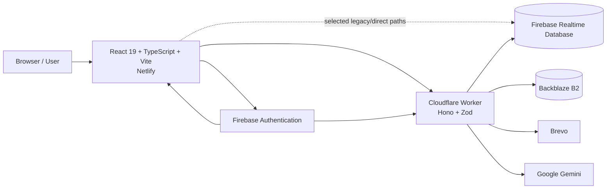

# LINC One

> **LInC Ministry's bilingual digital platform for connection, spiritual development, pastoral scheduling, NextGen participation, administration, attendance, shared resources, and ministry operations.**

LINC One is a React/TypeScript web application backed by Firebase and a growing Cloudflare Workers API. The platform serves public visitors, participants, the Pastor, delegated administrators, and NextGen users through one bilingual English/Arabic experience.

The project has moved well beyond its original spiritual-gifts assessment and single-page Pastor calendar. Its current architecture includes a substantive backend API for authentication-aware operations, booking, Pastor calendar mutations, People Notes, People Development, assessments, administrator management, archives, NextGen, transactional email, object storage, and the **Bezalel** AI assistants. Some established modules still access Firebase Realtime Database directly from the browser; those boundaries are called out explicitly in this README.

> [!IMPORTANT]
> This README documents the **current source tree**, not the historical state of earlier releases. The backend is no longer limited to meeting invitations, and Bezalel is now an active server-mediated AI capability. Historical refactor notes should not be used as the current architecture specification.

---

## Production Surfaces

| Surface | Current role |
|---|---|
| **Frontend** | `https://lincministry.com` — React/Vite application hosted on Netlify |
| **Backend** | `https://linc-backend.linc-ministry.workers.dev` — Hono API hosted on Cloudflare Workers |
| **Identity** | Firebase Authentication |
| **Primary application data** | Firebase Realtime Database |
| **Large-file/object storage** | Backblaze B2 through its S3-compatible API |
| **Transactional email** | Brevo from the Worker |
| **AI** | Google Gemini through the Worker |

The frontend and Worker are separate deployment surfaces. A frontend deployment does not implicitly deploy the backend, and the backend can be independently tested and deployed by GitHub Actions.

---

## Table of Contents

- [1. Product Scope](#1-product-scope)
- [2. Architecture](#2-architecture)
- [3. Access and Authorization Model](#3-access-and-authorization-model)
- [4. Frontend Routes](#4-frontend-routes)
- [5. Feature Reference](#5-feature-reference)
  - [5.1 Landing and Public Experience](#51-landing-and-public-experience)
  - [5.2 Spiritual Program and Assessments](#52-spiritual-program-and-assessments)
  - [5.3 Public Booking](#53-public-booking)
  - [5.4 Bezalel AI](#54-bezalel-ai)
  - [5.5 Pastor Calendar](#55-pastor-calendar)
  - [5.6 People Notes](#56-people-notes)
  - [5.7 People Development](#57-people-development)
  - [5.8 Congregation Group Notes Portal](#58-congregation-group-notes-portal)
  - [5.9 NextGen](#59-nextgen)
  - [5.10 Administrator Panel](#510-administrator-panel)
  - [5.11 Attendance](#511-attendance)
  - [5.12 LInC Archives](#512-linc-archives)
  - [5.13 Tutorial Builder](#513-tutorial-builder)
  - [5.14 Localization and Accessibility](#514-localization-and-accessibility)
- [6. Backend API Surface](#6-backend-api-surface)
- [7. Data and Storage](#7-data-and-storage)
- [8. External Integrations](#8-external-integrations)
- [9. Repository Structure](#9-repository-structure)
- [10. Getting Started](#10-getting-started)
- [11. Environment Configuration](#11-environment-configuration)
- [12. Local Development](#12-local-development)
- [13. Scripts](#13-scripts)
- [14. Testing](#14-testing)
- [15. CI/CD](#15-cicd)
- [16. Production Deployment](#16-production-deployment)
- [17. Security and Privacy Boundaries](#17-security-and-privacy-boundaries)
- [18. Migration and Legacy Boundaries](#18-migration-and-legacy-boundaries)
- [19. Development Conventions](#19-development-conventions)
- [20. Documentation and ERDs](#20-documentation-and-erds)
- [21. Troubleshooting](#21-troubleshooting)
- [22. License and Ownership](#22-license-and-ownership)

---

## 1. Product Scope

LINC One is intended to be the shared digital home for LInC Ministry programs, resources, and participation. The current product combines several previously separate ministry workflows.

### Primary audiences

| Audience | Main capabilities |
|---|---|
| **Public visitor** | Browse public content, learn about LInC One, complete assessments, view public booking availability, submit a meeting request, access public legal/help content |
| **Congregation participant** | Access group material using an identifier, view People Development assignments and meeting schedules |
| **Authenticated NextGen participant** | Open a NextGen account session, view QA sessions, submit questions, vote, access NextGen files and mission-map data exposed by the current backend |
| **Pastor** | Manage the calendar, availability, booking decisions, meeting invitations, People Notes, People Development, and use Pastor Bezalel |
| **Administrator** | Access only allocated administrative domains such as assessments, landing media, attendance, archives, or NextGen QA |
| **Chief administrator** | Manage the administrator hierarchy and has all administrator authorities |

### Core product domains

The current source implements or contains:

- Bilingual English/Arabic landing and navigation.
- About, privacy, terms, and Pastor guide pages.
- YAML-defined spiritual-development assessments.
- Public 30-minute meeting booking.
- Conflict-aware calendar reservation logic.
- Pastor meetings, availability, unavailability, and request decisions.
- Backend-generated transactional meeting email.
- Bezalel AI for Pastor calendar assistance and public booking assistance.
- Confidential Pastor People Notes.
- People Development groups, assignments, schedules, attachments, and notes.
- Congregation group-notes access by participant identifier.
- Account-based NextGen portal and QA sessions.
- Legacy NextGen activity compatibility paths.
- NextGen shared files using Backblaze B2.
- NextGen private mission-map configuration.
- Administrator hierarchy and capability allocation.
- Spiritual-program administration.
- Landing carousel/media administration.
- Attendance people management, recording, and analytics.
- LInC Archives with folder hierarchy and large-file storage.
- Interactive tutorial authoring and playback.
- Automated frontend build, backend tests/type-checking, backend deployment, and production smoke checks.

---

## 2. Architecture

LINC One is currently a **hybrid client/API architecture**. Sensitive and transactional workflows have increasingly moved to the Worker, while several mature frontend modules still use Firebase directly.



### Architectural responsibilities

| Layer | Responsibility |
|---|---|
| **React frontend** | Rendering, navigation, local state, user interaction, API clients, selected residual Firebase subscriptions/mutations |
| **Firebase Authentication** | Google and email/password identity, browser session persistence, Firebase ID tokens |
| **Cloudflare Worker** | Server-side authorization, validation, business workflows, Firebase Admin-style access, email orchestration, AI calls, signed object-storage operations |
| **Firebase Realtime Database** | Primary structured persistence for meetings, assessments, People Development, NextGen metadata, admin state, content, and legacy modules |
| **Backblaze B2** | Binary/object storage for LInC Archives and NextGen files |
| **Brevo** | Transactional email delivery from the backend |
| **Gemini** | Bezalel conversational/structured AI behavior, called only from backend AI services |

### Backend migration principle

New sensitive functionality should follow this direction:

```text
React UI
   ↓
typed frontend service
   ↓
authenticated/validated Worker route
   ↓
domain service / persistence / provider
```

Direct client Firebase code remains part of the current application and must not be assumed to have disappeared. See [Migration and Legacy Boundaries](#18-migration-and-legacy-boundaries).

---

## 3. Access and Authorization Model

LINC One uses Firebase Authentication for identity and multiple authorization layers for privileged workflows.

### Authentication

The frontend supports:

- Google Sign-In.
- Email/password authentication.
- Persistent Firebase browser sessions.
- Firebase ID-token transport to the Worker through the `Authorization: Bearer ...` header.

The backend validates Firebase ID tokens before authenticated API operations. Protected routes reuse the existing browser session; users are not asked to maintain a separate Worker login.

### Current authorization classes

#### Pastor

Pastor authorization is currently implemented server-side through an email allowlist in:

```text
backend/src/security/pastorAuthorization.ts
```

Pastor-protected APIs combine:

```text
Firebase token verification
        +
server-side Pastor allowlist
```

This is intentionally stronger than relying only on a client-side route guard. If the product expands to multiple Pastors or delegated pastoral permissions, this single-account allowlist should evolve into a data-driven capability model.

#### Administrator

Administrator state is stored under:

```text
administration/adminHierarchy
```

The backend establishes an administrator session and supports:

- `pending`
- `active`
- `suspended`

administrator states.

The current administrator authorities are:

| Authority | Grants access to |
|---|---|
| `manageAssessmentForms` | Spiritual-program forms and assessment administration |
| `manageCarousel` | Landing-page media/carousel management |
| `manageAttendance` | Attendance administration |
| `manageArchives` | LInC Archives |
| `manageNextGenQa` | NextGen QA management |

The **Chief** administrator has every authority and can allocate/revoke authorities or suspend other administrator accounts.

#### NextGen QA manager

NextGen QA management accepts either:

- the Pastor, or
- an active administrator with `manageNextGenQa`.

#### Public and identifier-based access

Some workflows are intentionally public:

- assessment form discovery/submission,
- public booking schedule and request creation,
- Bezalel public booking chat,
- People Development participant portal access using the participant identifier.

The People Development portal applies backend validation and a local backend rate limiter to repeated identifier attempts.

---

## 4. Frontend Routes

Routing is defined in `src/App.tsx`.

| Route | Surface | Access | Purpose |
|---|---|---|---|
| `/` | Landing | Public | LINC One home and primary navigation |
| `/about` | About Us | Public | Product/ministry introduction |
| `/assessment` | Spiritual Program | Public | Assessment selection and completion |
| `/booking` | Booking | Public | View safe availability and request a meeting |
| `/nextgen-activities` | NextGen Portal | Mixed | NextGen sign-in/session, activities and QA |
| `/nextgen-activities/qa/:sessionId` | NextGen QA | Authenticated workflow | Open a specific QA session |
| `/group-notes` | Congregation Group Notes | Identifier-based | Participant group assignments and schedules |
| `/calendar` | Pastor Dashboard | Pastor only | Calendar, requests, People Development and pastoral operations |
| `/pastor/people-notes` | People Notes | Pastor only | Confidential pastoral-development records |
| `/guide` | Pastor Guide | Pastor only | Pastor-facing application guidance |
| `/administrator` | Administrator Panel | Firebase + admin state | Capability-based administration |
| `/privacy` | Privacy Policy | Public | Privacy information |
| `/tos` | Terms of Service | Public | Terms of service |
| `*` | Redirect | Public | Redirect unknown paths to `/` |

---

## 5. Feature Reference

### 5.1 Landing and Public Experience

The landing experience presents LINC One as a shared ministry hub rather than only an assessment application.

#### Current behavior

- LINC One branded hero.
- English/Arabic presentation.
- RTL-aware Arabic layout.
- Primary navigation to major ministry experiences.
- Responsive floating quick-access navigation.
- Community carousel.
- Spiritual Program feature presentation.
- About Us page.
- Privacy Policy and Terms of Service.

#### Landing carousel

Public carousel data is read from:

```text
landingPage/carousel
```

The administrator interface currently manages this branch directly through the Firebase client. This is one of the intentional residual direct-Firebase areas.

---

### 5.2 Spiritual Program and Assessments

The assessment subsystem is YAML-driven and supports multiple forms instead of hard-coding a single questionnaire.

#### Active assessment definitions

```text
src/forms/five-service-pathways.yml
src/forms/spiritual-gifts-discovery.yml
```

The repository contains the YAML loader, assessment renderer, results/scoring logic, administrative controls, and backend submission APIs.

#### Participant capabilities

- Discover available forms.
- Complete bilingual assessment content.
- Submit responses.
- Receive calculated outcomes where configured.
- Create direct-signup records for supported workflows.

#### Administrative capabilities

Users with the appropriate administrator authority can:

- list assessment responses,
- filter responses by form,
- update participant/member linkage,
- delete a response,
- send an identifier email,
- enable/configure form availability through backend form controls.

#### Persistence

Core assessment response data remains under:

```text
form/
```

Assessment form-control state is stored under:

```text
assessmentPage/forms/
```

Public writes now pass through the Worker routes rather than requiring the browser to implement the submission contract itself.

---

### 5.3 Public Booking

The public booking feature exposes a privacy-safe schedule rather than raw Pastor calendar records.

#### Schedule behavior

The backend:

- accepts a requested date range,
- limits the range to a bounded window,
- works in the `America/Toronto` time zone,
- normalizes the public day to the configured `09:00`–`20:00` booking range,
- creates **30-minute** slots,
- accounts for availability,
- accounts for unavailability,
- accounts for existing meetings,
- accounts for pending meeting requests,
- accounts for People Development meeting schedules,
- accounts for temporary/committed calendar reservations.

#### Request creation

A public booking request includes validated participant and meeting information and is submitted through:

```text
POST /api/v1/booking/requests
```

The backend checks that the slot is still valid before accepting the request. It also claims a calendar-reservation key so two near-simultaneous callers cannot both successfully reserve the same slot merely because they loaded the same older frontend schedule.

#### Booking notification

Accepted public requests can trigger a backend Brevo notification to the configured booking notification recipient.

#### Privacy boundary

The public schedule is a derived availability projection. It should remain free of private meeting titles, participant identities, pastoral notes, or internal request reasons.

---

### 5.4 Bezalel AI

**Bezalel** is the LINC One AI assistant. The current implementation is server mediated; Gemini credentials are not placed in the React bundle.

There are two active conversational modes.

#### Pastor Bezalel

Endpoint:

```text
POST /api/v1/bezalel/pastor/chat
```

Access:

```text
Firebase-authenticated Pastor only
```

The Worker assembles a sanitized calendar context and sends it, the conversation, and the current Toronto date to Gemini. Gemini must return a structured action rather than directly mutating the database.

Current allowed action types are:

```text
none
open_availability
block_time
delete_availability
delete_unavailability
accept_request
reject_request
```

The frontend receives the structured action and executes it through the normal Pastor Calendar API, preserving the same backend validation/authorization boundary as a manual action.

This separation is deliberate:

```text
Gemini proposes a constrained action
        ↓
frontend interprets the action
        ↓
normal protected API performs the mutation
```

Gemini does **not** receive an unrestricted database credential and does not directly write arbitrary Firebase paths.

#### Public Booking Bezalel

Endpoint:

```text
POST /api/v1/bezalel/booking/chat
```

The Worker provides Gemini with a privacy-safe public schedule covering the bounded booking horizon. The assistant can:

- answer booking questions,
- collect missing booking details,
- suggest available times,
- produce a validated booking-ready payload.

The AI response uses stages such as:

```text
answer
collect
ready_to_book
```

When the conversation reaches `ready_to_book`, the frontend still submits through the standard booking API. Bezalel does not bypass booking conflict checks.

#### AI configuration

Backend AI bindings:

```text
GEMINI_API_KEY
GEMINI_MODEL
```

The Worker configuration currently declares `gemini-3.6-flash` as the default model value.

#### AI design boundary

Bezalel should remain:

- constrained by structured schemas,
- server mediated,
- privacy aware,
- action limited,
- unable to bypass ordinary authorization,
- unable to bypass booking/calendar conflict rules.

---

### 5.5 Pastor Calendar

The Pastor Dashboard is the primary pastoral operations surface.

#### Calendar capabilities

- Monthly calendar navigation.
- Meetings by date.
- Upcoming meeting views.
- Meeting creation.
- Meeting editing.
- Meeting deletion.
- Participant selection.
- Participant invitation delivery.
- Availability creation/edit/delete.
- Unavailability creation/edit/delete.
- Individual time blocking through availability/unavailability operations.
- Public meeting-request review.
- Accept/reject decisions.
- Request-to-meeting conversion.
- Requester status/cancellation communication.
- Conflict checks against other calendar resources.
- Recurring People Development schedule awareness.
- ICS export.
- Bezalel integration.

#### Backend ownership

Current Pastor Calendar mutations are exposed by:

```text
/api/v1/pastor-calendar
```

The route group requires Firebase authentication and Pastor authorization.

#### Meeting invitation flow

Participant invitations use the dedicated protected endpoint:

```text
Pastor saves meeting
        ↓
frontend meeting service
        ↓
Firebase ID token
        ↓
POST /api/v1/meeting-invitations
        ↓
server-side validation and bilingual template
        ↓
Brevo
```

The browser sends structured meeting/recipient data, not arbitrary email HTML or a Brevo API key.

#### Calendar consistency

The backend checks conflicts when creating/updating meetings and when accepting requests. Where applicable, it coordinates reservation records so a public request cannot quietly remain reserved after the corresponding meeting state changes.

---

### 5.6 People Notes

People Notes is a Pastor-only confidential record system for individual ministry-development observations.

#### Capabilities

- List people records.
- Create a person record.
- Delete a person record.
- Add development/note items.
- Delete items.
- Add item comments.
- Delete comments.
- Update follow-up state.
- Maintain server-side timestamps and actor metadata where implemented.

#### Access boundary

All People Notes API operations require:

```text
valid Firebase session
        +
Pastor authorization
```

The React People Notes page uses the backend service rather than directly reading/writing the confidential `peopleNotes` branch.

#### API root

```text
/api/v1/people-notes
```

Because this data is pastoral/confidential, future changes should preserve the backend-only access boundary rather than reintroducing direct browser database access.

---

### 5.7 People Development

People Development organizes participants into service/development groups, distributes assignments, maintains schedules, and supports Pastor-only notes.

#### Supported groups

The current domain defines ten bilingual groups:

1. Pastors
2. Prophets
3. Evangelists
4. Teachers
5. Apostles
6. Helpers
7. Mercy
8. Facilitators
9. Services
10. Giving

#### Pastor capabilities

- Load a complete People Development snapshot.
- Assign a participant to a group.
- Preserve group linkage back to source form records.
- Create group assignments.
- Address one or multiple groups where supported.
- Attach PDF material.
- Replace assignment attachments.
- Delete assignments.
- Create private personal notes.
- Delete personal notes.
- Create recurring meeting schedules.
- Edit recurring schedules.
- Delete recurring schedules.

#### Assignment attachments

Current People Development assignment attachments are still stored as data in Firebase rather than B2 objects.

Current constraints include:

```text
PDF only in the active frontend flow
maximum 1 MiB per PDF
maximum 5 attachments per assignment
```

This storage pattern is intentionally listed as a migration/hardening target because Base64/binary-like data is not an ideal long-term Realtime Database storage strategy.

#### Meeting schedules

People Development schedules support recurring definitions including:

- audience (`shared` or a specific group),
- group,
- weekday,
- ordinal occurrence (`first`, `second`, `third`, `fourth`, `last`),
- start time,
- duration,
- date range,
- active state.

These schedules participate in booking/calendar conflict calculations so public availability does not ignore recurring ministry meetings.

#### Participant portal

The public participant endpoint accepts an identifier and returns only the profile/group material that the participant is allowed to see:

```text
POST /api/v1/people-development/portal
```

It returns the participant's group profile plus applicable assignments and active schedules.

#### Notification transport

People Development assignment notification content is built by the backend and delivered through Brevo BCC in the current route implementation.

> [!WARNING]
> The current `/api/v1/people-development/notifications` endpoint validates its body but does **not** mount Firebase authentication middleware. It is a high-priority hardening item and should not be treated as a general-purpose public notification API.

---

### 5.8 Congregation Group Notes Portal

The `/group-notes` route is the congregation-facing view of People Development data.

#### Participant experience

After entering an identifier, the page can present:

- participant/member profile,
- assigned group,
- group summary,
- current assignments,
- assignment detail,
- attached documents,
- meeting calendar,
- upcoming group/shared meetings,
- a clear unassigned state when no group has been assigned.

The browser does not need Pastor access for this surface. Authorization is based on the identifier lookup performed by the backend portal service.

---

### 5.9 NextGen

The project contains a newer **Firebase-account-based NextGen portal** and residual compatibility code for older identifier/activity flows.

#### NextGen account session

The new portal uses Firebase Authentication and exposes:

```text
GET /api/v1/nextgen/session
```

The backend can normalize/migrate compatible legacy state into the current participant view where the service supports it.

#### QA sessions

Participants can:

- list available QA sessions,
- open an active session,
- submit questions,
- vote on questions.

Current question submission is constrained by backend rules, including a per-participant question limit.

QA sessions can move among states such as:

```text
draft
open
closed
```

#### AI-assisted QA behavior

The NextGen QA domain uses backend Gemini support for AI-assisted operations such as:

- bilingual theme translation,
- question/theme relevance review.

AI results remain part of the application workflow rather than a direct database-control surface.

#### QA management

A Pastor or administrator with `manageNextGenQa` can:

- list management sessions,
- create a session,
- update session metadata/state,
- inspect a session in management view,
- select/deselect questions for discussion,
- verify/discard participant status.

#### Voting

Authenticated participants can vote through the backend route for a question. The service derives vote identity from authenticated account information rather than trusting an arbitrary client-supplied voter identifier.

#### NextGen files

NextGen includes folder/file APIs using Backblaze B2 object storage.

The flow is:

```text
create metadata / request signed upload URL
        ↓
browser uploads directly to B2
        ↓
backend verifies stored object
        ↓
metadata becomes ready
```

Downloads similarly use short-lived signed URLs rather than exposing B2 application keys.

The backend declares support for very large objects (up to the configured 5 GB application limit in the file service/schema path).

> [!CAUTION]
> The current NextGen file routes require Firebase authentication but do not yet add a narrower member/manager authorization check for each file/folder operation. Tightening that policy is a current security priority.

#### Mission map

The Montréal mission-map endpoint reads structured map JSON from the Worker secret/configuration binding:

```text
NEXTGEN_MISSION_MAP_DATA
```

It validates:

- location IDs,
- location types,
- addresses,
- latitude/longitude,
- optional notes/parking/languages,
- connection endpoints.

The frontend renders mission data with map tooling including Leaflet/React Leaflet and Google Maps support elsewhere in the project.

> [!CAUTION]
> The current mission-map route verifies Firebase authentication but authorizes any authenticated user whose Firebase account has an email. If the map is intended for a narrower mission-trip audience, this must be tightened before relying on it as a private-data boundary.

#### Legacy NextGen compatibility

Older functionality remains under:

```text
src/components/nextgen/activities/
```

and uses direct Firebase areas such as:

```text
nextGenUsers/
nextGenActivities/
```

These paths cover legacy registration/participation/survey/question behavior and should not be confused with the newer `/api/v1/nextgen` portal architecture.

---

### 5.10 Administrator Panel

The administrator experience is a standalone capability-driven interface at:

```text
/administrator
```

#### Administrator areas

The current command center can expose:

- **Overview**
- **Administrators** — Chief only
- **Spiritual Program**
- **Landing Media**
- **Attendance**
- **NextGen QA**
- **LInC Archives**

Visibility is computed from the current administrator session and authority allocation.

#### Administrator bootstrap and hierarchy

`GET /api/v1/admin/session` establishes the current administrative session. The current backend bootstrap behavior can create the first Chief from the Pastor when no Chief exists; otherwise a newly encountered account can be represented as a pending administrator until approved/allocated.

Chief-only actions include:

- changing an administrator authority set,
- suspending/reactivating administrator access.

#### Mixed backend/client architecture

Not every administrator feature has the same persistence path yet:

- assessment administration uses backend APIs,
- archives use backend APIs + B2,
- NextGen QA uses backend APIs,
- administrator hierarchy uses backend APIs,
- landing carousel management still uses direct client Firebase,
- attendance still uses direct client Firebase,
- tutorial authoring/progress still uses direct client Firebase.

This distinction is important when reviewing authorization and Firebase Rules.

---

### 5.11 Attendance

Attendance is rendered within the Administrator Panel when the current administrator has `manageAttendance`.

#### Current capabilities

- People/member list.
- Add/edit person records.
- Person details modal.
- Photo/camera-related person data handling.
- Attendance date selection.
- Record attendance.
- Attendance search/filtering.
- Attendance analytics.
- Individual/personal attendance analysis.
- Historical attendance-day handling.

#### Current persistence boundary

The active attendance implementation still uses the Firebase client directly, including paths under:

```text
attendance/people/
```

Therefore `manageAttendance` in the React UI is not, by itself, a complete data-security boundary. Firebase Realtime Database Security Rules must independently enforce the intended authorization policy.

---

### 5.12 LInC Archives

LInC Archives is the administrator-managed document/file repository.

#### Access

Requires:

```text
Firebase authentication
        +
active administrator session
        +
manageArchives authority (or Chief)
```

#### Folder capabilities

- List folders.
- Create folders.
- Delete folders subject to service rules.
- Maintain parent/child hierarchy metadata.

#### File capabilities

- List files.
- Request a signed upload URL.
- Complete/verify an uploaded file.
- Request a signed download URL.
- Delete file object and metadata.

#### Storage architecture

Archive metadata lives in Firebase under the administration hierarchy, while binary file content lives in Backblaze B2.

```text
React Administrator UI
        ↓
Worker authorization
        ↓
Firebase metadata + B2 signed URL
        ↓
Browser ↔ B2 object transfer
```

B2 application credentials stay in Worker bindings/secrets.

---

### 5.13 Tutorial Builder

LINC One contains an in-application tutorial authoring/playback system.

#### Current feature modules include

- tutorial context/provider,
- tutorial builder section,
- tutorial editor,
- tutorial library,
- simulation layer,
- target picker,
- tutorial player,
- progress tracking.

#### Current Firebase paths

```text
tutorialBuilder/tutorials
tutorialBuilder/progress
```

The tutorial system currently uses Firebase client operations directly. Any future delegated tutorial-author role must therefore be paired with matching backend migration or strict Firebase Rules.

---

### 5.14 Localization and Accessibility

The application is designed around bilingual English/Arabic operation.

Current localization behavior includes:

- shared i18n context,
- English and Arabic translation dictionaries/content,
- RTL direction changes for Arabic,
- bilingual assessment content,
- bilingual transactional email templates where implemented,
- localized Bezalel responses,
- localized calendar/date display,
- localized NextGen/People Development labels.

UI code also includes accessibility-oriented labels and semantic controls across current modules. New functionality should preserve both locale and direction behavior rather than treating Arabic as a later visual translation pass.

---

## 6. Backend API Surface

The Worker mounts all application APIs under `/api/v1`.

Base URL in production:

```text
https://linc-backend.linc-ministry.workers.dev
```

The frontend may override this through `VITE_BACKEND_BASE_URL` for local/preview development.

### 6.1 Health and provider test

| Method | Path | Access | Purpose |
|---|---|---|---|
| `GET` | `/` | Public | Basic Worker health response (`Hello Hono!`) |
| `POST` | `/api/v1/email/test` | Currently public route | Temporary fixed-recipient Brevo connectivity test |

> [!WARNING]
> `/api/v1/email/test` is an operational test endpoint. It should be restricted or removed once it is no longer needed.

### 6.2 Authentication

All routes below are mounted under `/api/v1/auth` and require Firebase authentication.

| Method | Relative path | Purpose |
|---|---|---|
| `GET` | `/session` | Return normalized authenticated Firebase session data |
| `GET` | `/pastor-access` | Return current Pastor-access determination |

### 6.3 Booking

Mounted under `/api/v1/booking`.

| Method | Relative path | Access | Purpose |
|---|---|---|---|
| `GET` | `/schedule` | Public | Return privacy-safe availability for a validated date range |
| `POST` | `/requests` | Public | Create a validated 30-minute booking request and claim the slot |

### 6.4 Bezalel

Mounted under `/api/v1/bezalel`.

| Method | Relative path | Access | Purpose |
|---|---|---|---|
| `POST` | `/pastor/chat` | Pastor | Generate a constrained calendar/action response from Gemini |
| `POST` | `/booking/chat` | Public | Answer/collect/suggest booking information against safe public availability |

### 6.5 Pastor Calendar

Mounted under `/api/v1/pastor-calendar`. All routes require Firebase authentication and Pastor access.

| Method | Relative path | Purpose |
|---|---|---|
| `GET` | `/` | Return Pastor calendar snapshot |
| `GET` | `/export.ics` | Export current calendar data as ICS |
| `POST` | `/meetings` | Create a meeting after conflict validation |
| `PATCH` | `/meetings/:meetingId` | Update a meeting and related reservation/request state |
| `DELETE` | `/meetings/:meetingId` | Delete a meeting and perform related cleanup/notification behavior |
| `POST` | `/availability` | Create an availability block |
| `PATCH` | `/availability/:blockId` | Update availability |
| `DELETE` | `/availability/:blockId` | Delete availability |
| `POST` | `/unavailability` | Create an unavailability block subject to conflict rules |
| `PATCH` | `/unavailability/:blockId` | Update unavailability subject to conflict rules |
| `DELETE` | `/unavailability/:blockId` | Delete unavailability |
| `POST` | `/meeting-requests/:requestId/decision` | Accept or reject a public meeting request |

### 6.6 Meeting Invitations

Mounted under `/api/v1/meeting-invitations`.

| Method | Relative path | Access | Purpose |
|---|---|---|---|
| `POST` | `/` | Pastor | Validate recipients/meeting, build bilingual email, send through Brevo |

The route returns structured complete, partial, validation, authentication, and provider-failure responses rather than exposing provider internals to the UI.

### 6.7 People Notes

Mounted under `/api/v1/people-notes`. All routes require Pastor access.

| Method | Relative path | Purpose |
|---|---|---|
| `GET` | `/` | List normalized people/note data |
| `POST` | `/` | Create a person record |
| `POST` | `/:personId/items` | Create an item for a person |
| `POST` | `/:personId/items/:itemId/comments` | Add a comment to an item |
| `PATCH` | `/:personId/items/:itemId/follow-up` | Update follow-up state |
| `DELETE` | `/:personId` | Delete a person record |
| `DELETE` | `/:personId/items/:itemId` | Delete an item |
| `DELETE` | `/:personId/items/:itemId/comments/:commentId` | Delete a comment |

### 6.8 People Development

Mounted under `/api/v1/people-development`.

#### Participant portal

| Method | Relative path | Access | Purpose |
|---|---|---|---|
| `POST` | `/portal` | Public identifier-based | Return the matched member profile, group assignments, and schedules |

#### Pastor routes

Pastor routes are mounted under `/api/v1/people-development/pastor` and require Firebase authentication + Pastor access.

| Method | Relative path | Purpose |
|---|---|---|
| `GET` | `/snapshot` | Load members, assignments, personal notes, and schedules |
| `PATCH` | `/members/:memberKey/group` | Assign/update a member's People Development group and source linkage |
| `POST` | `/assignments` | Create an assignment |
| `PATCH` | `/assignments/:assignmentId/attachments` | Replace assignment attachments |
| `DELETE` | `/assignments/:assignmentId` | Delete an assignment |
| `POST` | `/personal-notes` | Create a Pastor personal note |
| `DELETE` | `/personal-notes/:noteId` | Delete a personal note |
| `POST` | `/schedules` | Create a recurring meeting schedule |
| `PATCH` | `/schedules/:scheduleId` | Update a schedule |
| `DELETE` | `/schedules/:scheduleId` | Delete a schedule |

#### Notifications

| Method | Path | Current access | Purpose |
|---|---|---|---|
| `POST` | `/api/v1/people-development/notifications` | **No auth middleware currently mounted** | Validate and deliver People Development assignment notification through Brevo BCC |

This endpoint is a documented hardening priority.

### 6.9 Assessments

Mounted under `/api/v1/assessment`.

#### Public routes

| Method | Relative path | Purpose |
|---|---|---|
| `GET` | `/forms` | Return available assessment form metadata/configuration |
| `POST` | `/submissions` | Validate and persist an assessment response |
| `POST` | `/direct-signups` | Create a supported direct-signup record |

#### Assessment-administration routes

These routes require the applicable administrator/Pastor authorization path implemented by the assessment route helper.

| Method | Relative path | Purpose |
|---|---|---|
| `GET` | `/admin/responses` | List/filter assessment responses |
| `PATCH` | `/admin/responses/:responseId/linkage` | Update member/identifier linkage |
| `DELETE` | `/admin/responses/:responseId` | Delete an assessment response |
| `POST` | `/admin/responses/:responseId/identifier-email` | Send identifier email and update associated metadata |
| `PATCH` | `/admin/forms/:formId` | Update form-control settings |

### 6.10 Administrator API

Mounted under `/api/v1/admin`. The group requires Firebase authentication.

| Method | Relative path | Additional access | Purpose |
|---|---|---|---|
| `GET` | `/session` | Authenticated | Establish/return administrator account/session |
| `PATCH` | `/users/:uid/authority` | Chief | Allocate administrator authorities |
| `PATCH` | `/users/:uid/suspend` | Chief | Suspend/reactivate administrator account |
| `GET` | `/archives/folders` | `manageArchives`/Chief | List archive folders |
| `POST` | `/archives/folders` | `manageArchives`/Chief | Create archive folder |
| `DELETE` | `/archives/folders/:folderId` | `manageArchives`/Chief | Delete archive folder |
| `GET` | `/archives/files` | `manageArchives`/Chief | List archive files |
| `POST` | `/archives/files/upload-url` | `manageArchives`/Chief | Create pending file metadata and signed B2 upload URL |
| `POST` | `/archives/files/:fileId/complete` | `manageArchives`/Chief | Verify/complete B2 upload |
| `GET` | `/archives/files/:fileId/download-url` | `manageArchives`/Chief | Create signed B2 download URL |
| `DELETE` | `/archives/files/:fileId` | `manageArchives`/Chief | Delete object and metadata |

### 6.11 NextGen Mission Map

Mounted under:

```text
/api/v1/nextgen/mission-map
```

| Method | Relative path | Current access | Purpose |
|---|---|---|---|
| `GET` | `/` | Firebase-authenticated account with an email | Validate and return private mission-map configuration |

The current authorization is intentionally called out as broader than a mission-specific audience.

### 6.12 NextGen Portal and QA

Mounted under `/api/v1/nextgen`.

`GET /health` is public. Other NextGen routes are behind Firebase authentication in the current router.

#### Session and participant QA

| Method | Relative path | Purpose |
|---|---|---|
| `GET` | `/health` | Public deployment/API contract health check |
| `GET` | `/session` | Return/migrate normalized NextGen participant session |
| `GET` | `/qa/sessions` | List participant-visible QA sessions |
| `GET` | `/qa/sessions/:sessionId` | Return an open QA session view for the member |
| `POST` | `/qa/sessions/:sessionId/questions` | Submit a question subject to service limits/relevance workflow |
| `POST` | `/qa/sessions/:sessionId/questions/:questionId/votes` | Cast/update the participant vote behavior implemented by the service |

#### QA management

Requires Pastor or `manageNextGenQa` administrator access.

| Method | Relative path | Purpose |
|---|---|---|
| `GET` | `/pastor/qa/sessions` | List sessions for management |
| `POST` | `/pastor/qa/sessions` | Create a QA session |
| `PATCH` | `/pastor/qa/sessions/:sessionId` | Update session metadata/state |
| `GET` | `/pastor/qa/sessions/:sessionId` | Return management session view |
| `PATCH` | `/pastor/qa/sessions/:sessionId/questions/:questionId` | Set discussion-selection state |
| `PATCH` | `/pastor/qa/sessions/:sessionId/participants/:participantUid` | Update participant verification/discard state |

#### NextGen files

| Method | Relative path | Current access | Purpose |
|---|---|---|---|
| `GET` | `/files/folders` | Authenticated Firebase user | List folders |
| `POST` | `/files/folders` | Authenticated Firebase user | Create folder |
| `DELETE` | `/files/folders/:folderId` | Authenticated Firebase user | Delete folder |
| `GET` | `/files` | Authenticated Firebase user | List files |
| `POST` | `/files/upload-url` | Authenticated Firebase user | Create pending metadata + signed upload URL |
| `POST` | `/files/:fileId/complete` | Authenticated Firebase user | Inspect B2 object and complete metadata |
| `GET` | `/files/:fileId/download-url` | Authenticated Firebase user | Create signed download URL |
| `DELETE` | `/files/:fileId` | Authenticated Firebase user | Delete object and metadata |

The current router should be hardened with a narrower file authorization policy if file content is not intended for every authenticated Firebase account.

---

## 7. Data and Storage

### 7.1 Firebase Realtime Database

Realtime Database remains the primary structured-data store.

Important current or legacy roots include:

| Root | Domain |
|---|---|
| `form/` | Assessment submissions and participant source records |
| `assessmentPage/forms/` | Assessment availability/control state |
| `meetings/` | Confirmed Pastor meetings |
| `meetingRequests/` | Public booking requests |
| `calendarReservations/` | Slot reservation/claim coordination |
| `availability/` | Pastor availability |
| `unavailability/` | Pastor blocked/unavailable time |
| `peopleNotes/` | Confidential Pastor People Notes |
| `peopleDevelopment/members/` | Normalized People Development members |
| `peopleDevelopment/assignments/` | Group assignments and current embedded attachments |
| `peopleDevelopment/personalNotes/` | Pastor personal People Development notes |
| `peopleDevelopment/meetingSchedules/` | Recurring ministry schedules |
| `administration/adminHierarchy/` | Chief/admin accounts and authorities |
| `administration/archives/folders/` | Archive folder metadata |
| `administration/archives/files/` | Archive object metadata |
| `nextGenPortal/` | New NextGen portal, QA, and file metadata |
| `nextGenUsers/` | Legacy NextGen user state |
| `nextGenActivities/` | Legacy NextGen activities/surveys/participation |
| `landingPage/carousel/` | Public landing carousel content |
| `attendance/people/` | Attendance person data/current attendance workflow |
| `tutorialBuilder/tutorials/` | Tutorial definitions |
| `tutorialBuilder/progress/` | Per-user tutorial progress |

The exact database model is documented more thoroughly in the Mermaid ERDs under `documentation/database/`.

### 7.2 Backblaze B2

B2 is used for object storage where embedding file contents in Firebase is inappropriate.

Current B2-backed domains:

- LInC Archives.
- NextGen files.

The Worker signs S3-compatible requests using `aws4fetch`. The browser receives only temporary signed upload/download URLs.

### 7.3 Embedded/Base64 attachment residue

People Development assignment PDFs are still represented inside Realtime Database data. This should be treated as a transitional storage design and a candidate for B2 migration.

### 7.4 Firebase Storage / Firestore

Firebase configuration initializes additional Firebase services where present in source, but Realtime Database is the dominant application database in the current codebase. Do not assume Firestore is the authoritative store for a domain unless that domain explicitly uses it.

---

## 8. External Integrations

| Provider / library | Current role |
|---|---|
| **Firebase Authentication** | User identity and ID tokens |
| **Firebase Realtime Database** | Primary application persistence |
| **Cloudflare Workers** | Server/API runtime |
| **Brevo** | Transactional email delivery |
| **Google Gemini / `@google/genai`** | Bezalel AI and AI-assisted NextGen behavior |
| **Backblaze B2** | Object storage for Archives and NextGen files |
| **Google Maps JavaScript API** | Browser map functionality where used |
| **Leaflet / React Leaflet** | Map rendering for map-oriented UI |
| **EmailJS** | Residual legacy client email paths/initialization |
| **Google OAuth/Gmail/Calendar/Meet code** | Legacy/partial service code retained in `src/services/` |
| **Netlify** | Frontend hosting/build |
| **GitHub Actions** | Frontend build, backend tests, backend deployment, production smoke |

### Email architecture

The preferred current transport is:

```text
Frontend request
    ↓
Worker authorization + validation
    ↓
backend-owned email template
    ↓
Brevo
```

This pattern is used across current backend notification workflows and prevents provider secrets from being sent to the browser.

### Legacy email/Google code

`App.tsx` still initializes EmailJS, and legacy Google-related services remain under `src/services/`, including Gmail/Meet integration code. Their presence should not be interpreted as the target architecture for new notification work.

---

## 9. Repository Structure

The repository is organized around a React frontend, a nested Worker backend, automated workflows, and architecture/database documentation.

```text
LInC-Church-Management/
├── .github/
│   └── workflows/
│       ├── backend-production-smoke.yml
│       ├── backend-tests.yml
│       └── frontend-build.yml
│
├── backend/
│   ├── scripts/
│   │   └── production-smoke.mjs
│   ├── src/
│   │   ├── admin/
│   │   ├── assessment/
│   │   ├── bezalel/
│   │   ├── booking/
│   │   ├── calendar/
│   │   ├── emails/
│   │   ├── nextgen/
│   │   ├── pastorCalendar/
│   │   ├── peopleDevelopment/
│   │   ├── peopleNotes/
│   │   ├── routes/
│   │   ├── schemas/
│   │   ├── security/
│   │   ├── services/
│   │   ├── types/
│   │   └── index.ts
│   ├── test/
│   ├── .dev.vars.example
│   ├── package.json
│   ├── tsconfig.json
│   ├── vitest.config.ts
│   └── wrangler.jsonc
│
├── documentation/
│   ├── database/
│   │   ├── 01_ChurchOne_Database_Overview_ERD.mmd
│   │   ├── 02_ChurchOne_Identity_and_Administration_ERD.mmd
│   │   ├── 03_ChurchOne_Assessments_ERD.mmd
│   │   ├── 04_ChurchOne_Meetings_and_Attendance_ERD.mmd
│   │   ├── 05_ChurchOne_People_Development_ERD.mmd
│   │   ├── 06_ChurchOne_NextGen_ERD.mmd
│   │   ├── 07_ChurchOne_Tutorial_and_Content_ERD.mmd
│   │   └── 08_ChurchOne_Complete_Detailed_Firebase_ERD.mmd
│   ├── main.tex
│   ├── mainErd.mmd
│   └── README.md
│
├── src/
│   ├── components/
│   │   ├── admin/
│   │   │   ├── archives/
│   │   │   ├── attendance/
│   │   │   ├── components/
│   │   │   └── hooks/
│   │   ├── assessment/
│   │   ├── bezalel/
│   │   ├── brand/
│   │   ├── congregation-group-notes/
│   │   ├── forms/
│   │   ├── landing/
│   │   ├── linc/
│   │   ├── nextgen/
│   │   │   ├── activities/
│   │   │   └── portal/
│   │   ├── pastor/
│   │   │   ├── calendar/
│   │   │   ├── hooks/
│   │   │   ├── meeting-requests/
│   │   │   ├── nextgen/
│   │   │   └── people-development/
│   │   ├── people-notes/
│   │   └── tutorial-builder/
│   ├── forms/
│   ├── i18n/
│   ├── pages/
│   ├── services/
│   ├── App.tsx
│   ├── firebase.ts
│   ├── main.tsx
│   └── types.ts
│
├── public/
├── .env.example
├── netlify.toml
├── package.json
├── tsconfig.json
└── vite.config.ts
```

### Frontend responsibility pattern

| Responsibility | Typical location |
|---|---|
| Page composition/routing | `src/pages/`, `src/App.tsx` |
| Domain UI | `src/components/<domain>/` |
| Stateful feature orchestration | domain hooks |
| Pure transformations | `*.utils.ts`, selectors/helpers |
| Frontend API clients | `src/services/` |
| Legacy/direct Firebase modules | domain `*.firebase.ts` or feature hooks |
| Localization | `src/i18n/` |
| Assessment definitions | `src/forms/*.yml` |

### Backend responsibility pattern

| Responsibility | Location |
|---|---|
| Route composition | `backend/src/routes/` |
| Runtime request validation | `backend/src/schemas/` |
| Authentication/authorization | `backend/src/security/` |
| Domain business logic | domain folders such as `booking/`, `nextgen/`, `assessment/` |
| Transactional email builders | `backend/src/emails/` |
| Provider/data clients | `backend/src/services/` |
| Worker bindings/types | `backend/src/types/` |
| App composition/CORS | `backend/src/index.ts` |
| Automated backend tests | `backend/test/` |

---

## 10. Getting Started

### Prerequisites

Recommended development environment:

- **Node.js 24** — matches current GitHub Actions.
- npm.
- Firebase project with Authentication and Realtime Database.
- Cloudflare account for Worker development/deployment.
- Wrangler authentication for the Worker.
- Brevo account and verified sender for transactional email.
- Google Gemini API credentials for Bezalel/AI features.
- Backblaze B2 bucket + S3-compatible application credentials for file features.
- Google Maps browser key if map UI is being exercised.

Legacy Google/EmailJS functionality may require additional provider configuration if those paths are being tested.

### Clone and install

```bash
git clone <repository-url>
cd LInC-Church-Management
npm ci
```

The Worker has its own package boundary, so install its dependencies separately:

```bash
cd backend
npm ci
cd ..
```

Using `npm ci` is recommended when `package-lock.json` is present because it matches CI dependency resolution.

---

## 11. Environment Configuration

Never commit actual secrets. Browser variables and Worker secrets have different trust levels.

### 11.1 Frontend environment

Start with:

```bash
cp .env.example .env
```

#### Current frontend variables

| Variable | Required for | Notes |
|---|---|---|
| `VITE_FIREBASE_API_KEY` | Firebase browser SDK | Firebase web configuration; not a server secret |
| `VITE_FIREBASE_AUTH_DOMAIN` | Firebase Auth | Browser configuration |
| `VITE_FIREBASE_PROJECT_ID` | Firebase | Browser configuration |
| `VITE_FIREBASE_STORAGE_BUCKET` | Firebase config | Browser configuration |
| `VITE_FIREBASE_MESSAGING_SENDER_ID` | Firebase config | Browser configuration |
| `VITE_FIREBASE_APP_ID` | Firebase | Browser configuration |
| `VITE_FIREBASE_MEASUREMENT_ID` | Firebase Analytics | Optional depending on analytics usage |
| `VITE_GOOGLE_MAPS_API_KEY` | Maps | Restrict by website referrer and API scope |
| `VITE_BACKEND_BASE_URL` | Local/preview backend | Optional; frontend services can default to the production Worker |
| `VITE_GOOGLE_CLIENT_ID` | Legacy Google OAuth | Retained for legacy integration paths |
| `GOOGLE_CLIENT_SECRET` | Legacy configuration | **Must never be exposed as a Vite/browser variable**; review legacy flow before use |
| `GOOGLE_REDIRECT_URI` | Legacy OAuth | Retained in `.env.example` for legacy flow |

> [!NOTE]
> Variables prefixed with `VITE_` are compiled for browser use. Never place Brevo, Gemini, B2 application credentials, Firebase service-account private keys, or other server secrets in a `VITE_*` variable.

### 11.2 Backend local configuration

Create:

```text
backend/.dev.vars
```

Use `backend/.dev.vars.example` as a starting point, then supply the bindings needed by the routes you are exercising.

#### Worker secret/sensitive bindings

| Binding | Purpose |
|---|---|
| `BREVO_API_KEY` | Authenticate Brevo transactional email calls |
| `BREVO_SENDER_EMAIL` | Verified backend sender |
| `BREVO_SENDER_NAME` | Transactional sender display name |
| `BREVO_TEST_RECIPIENT` | Fixed recipient for the temporary email test endpoint |
| `FIREBASE_SERVICE_ACCOUNT_EMAIL` | Service-account identity for server-side Firebase Admin-style access where required |
| `FIREBASE_SERVICE_ACCOUNT_PRIVATE_KEY` | Service-account signing key; secret |
| `B2_APPLICATION_KEY_ID` | Backblaze B2 S3 credential ID |
| `B2_APPLICATION_KEY` | Backblaze B2 S3 credential secret |
| `GEMINI_API_KEY` | Gemini/Bezalel API credential |
| `NEXTGEN_MISSION_MAP_DATA` | Private serialized mission-map data/configuration |

#### Worker configuration/non-secret bindings

| Binding | Purpose |
|---|---|
| `FIREBASE_PROJECT_ID` | Firebase token/project validation |
| `FIREBASE_DATABASE_URL` | Realtime Database endpoint |
| `BOOKING_NOTIFICATION_EMAIL` | Recipient for public-booking notifications |
| `B2_BUCKET_NAME` | B2 bucket name |
| `B2_S3_ENDPOINT` | B2 S3-compatible endpoint |
| `B2_REGION` | B2 region |
| `GEMINI_MODEL` | Gemini model selection |

Production secrets should be configured through Cloudflare Worker secrets/environment configuration, not committed to `wrangler.jsonc` or source code.

### 11.3 Cloudflare CI credentials

The production backend deployment workflow expects GitHub environment/repository secrets for:

```text
CLOUDFLARE_ACCOUNT_ID
CLOUDFLARE_API_TOKEN
```

These credentials are used by the deployment job only after backend tests and type-checking pass.

---

## 12. Local Development

### Frontend only

From the repository root:

```bash
npm run dev
```

Vite normally serves:

```text
http://localhost:5173
```

That origin is included in the Worker's current CORS allowlist.

### Worker only

```bash
cd backend
npm run dev
```

Wrangler loads local bindings from `backend/.dev.vars`.

### Frontend + Worker together

Use two terminals.

**Terminal 1**

```bash
npm run dev
```

**Terminal 2**

```bash
cd backend
npm run dev
```

Then point the frontend to the local/preview Worker as needed:

```env
VITE_BACKEND_BASE_URL=<local-or-preview-worker-url>
```

Restart Vite after changing a `VITE_*` variable.

### CORS

The current Worker allows browser API requests from:

```text
https://lincministry.com
http://localhost:5173
```

Allowed API headers:

```text
Content-Type
Authorization
```

Allowed methods:

```text
GET
POST
PATCH
DELETE
OPTIONS
```

If a new frontend origin is introduced, update CORS intentionally in `backend/src/index.ts` rather than weakening it to `*` for authenticated/sensitive routes.

---

## 13. Scripts

### Frontend scripts

Run from the repository root.

| Command | Purpose |
|---|---|
| `npm run dev` | Start Vite development server |
| `npm run build` | Run `tsc -b` then create Vite production bundle |
| `npm run lint` | Run ESLint |
| `npm test` | Run frontend Vitest suite once |
| `npm run test:watch` | Run frontend tests in watch mode |
| `npm run preview` | Preview the production bundle locally |

### Backend scripts

Run from `backend/`.

| Command | Purpose |
|---|---|
| `npm run dev` | Start local Worker with Wrangler |
| `npm test` | Run backend Vitest suite |
| `npm run test:watch` | Run backend tests in watch mode |
| `npm run typecheck` | Run backend TypeScript validation without emit |
| `npm run deploy` | Deploy minified Worker with Wrangler |
| `npm run smoke:production` | Verify the deployed NextGen backend contract |
| `npm run cf-typegen` | Generate Cloudflare binding types |

---

## 14. Testing

The repository contains both frontend and backend automated tests.

### Frontend

Run:

```bash
npm test
```

or:

```bash
npm run test:watch
```

Current frontend tests cover feature utilities, service behavior, components, navigation, administrator helpers, archive hierarchy logic, NextGen client behavior, and other domain-specific contracts.

### Backend

Run:

```bash
cd backend
npm test
npm run typecheck
```

Backend tests exercise route/service contracts including authentication boundaries, validation, booking/calendar behavior, NextGen behavior, People Development, admin/assessment services, provider boundaries, and other Worker functionality.

### Production smoke test

```bash
cd backend
npm run smoke:production
```

The current smoke script verifies the deployed NextGen API contract, including:

- `GET /api/v1/nextgen/health` returns a successful JSON contract with `contractVersion: 1`.
- protected NextGen endpoints reject unauthenticated access.

Optional smoke environment values include:

```text
LINC_BACKEND_URL
LINC_SMOKE_ATTEMPTS
LINC_SMOKE_RETRY_DELAY_MS
```

---

## 15. CI/CD

The repository has three GitHub Actions workflows.

### Frontend Build

```text
.github/workflows/frontend-build.yml
```

On relevant pushes and pull requests it:

```text
checkout
  ↓
Node 24
  ↓
npm ci
  ↓
npm run build
```

This validates TypeScript and the production Vite bundle.

### Backend Tests + Production Deployment

```text
.github/workflows/backend-tests.yml
```

For relevant backend changes it runs:

```text
checkout
  ↓
Node 24
  ↓
npm ci
  ↓
npm test
  ↓
npm run typecheck
```

On `main` after a successful test job, the production deployment job can:

```text
verify Cloudflare credentials
  ↓
npm run deploy
  ↓
npm run smoke:production
```

The deployment uses a production GitHub environment and a concurrency group so backend production deployments are serialized rather than racing one another.

### Scheduled Production Smoke

```text
.github/workflows/backend-production-smoke.yml
```

This workflow:

- supports manual dispatch,
- runs daily on its configured cron schedule,
- installs backend dependencies,
- executes `npm run smoke:production` against the deployed Worker.

---

## 16. Production Deployment

### Frontend

Netlify uses:

```toml
[build]
command = "npm run build"
publish = "dist"
```

and an SPA redirect to `index.html`.

Normal frontend production flow:

```text
push frontend change
    ↓
CI frontend build
    ↓
Netlify build/deploy
    ↓
https://lincministry.com
```

### Backend

The preferred production backend path is the tested GitHub Actions deployment on `main`:

```text
backend change
    ↓
backend tests + typecheck
    ↓
Cloudflare deployment
    ↓
production smoke test
```

Manual deployment remains available when appropriate:

```bash
cd backend
npm test
npm run typecheck
npm run deploy
npm run smoke:production
```

### Cross-surface changes

If a feature changes both an API contract and the React client, validate both surfaces. A compatible sequence is:

```text
1. Test frontend/backend locally.
2. Preserve backward compatibility where deployment ordering matters.
3. Merge/deploy the backend contract.
4. Verify backend smoke/provider behavior.
5. Publish the compatible frontend.
6. Exercise the real end-to-end workflow.
```

Do not assume a successful Netlify deployment means the Worker was updated, or vice versa.

---

## 17. Security and Privacy Boundaries

LINC One handles confidential pastoral, participant, scheduling, attendance, and ministry-development data. Security decisions must therefore be treated as product functionality, not only infrastructure cleanup.

### Implemented protections

Current source includes important security improvements:

- Firebase ID-token verification in the Worker.
- Server-side Pastor authorization for protected pastoral APIs.
- Capability-based administrator authorization for backend-managed admin domains.
- Strict Zod request validation across backend routes.
- Server-owned email templates instead of arbitrary HTML relay behavior.
- Brevo secrets retained in Worker configuration.
- Gemini credentials retained in Worker configuration.
- B2 credentials retained in Worker configuration.
- Signed B2 upload/download URLs rather than exposing storage credentials.
- CORS restricted to the production frontend and local Vite origin.
- Conflict-aware booking/calendar logic.
- Calendar reservation claims for double-booking protection.
- Privacy-safe public booking schedule projection.
- No-store/private cache headers on sensitive API responses where implemented.
- Rate limiting for People Development identifier portal attempts.
- Automated backend tests/type-checking before production Worker deployment.
- Scheduled production contract smoke checks.

### Current hardening priorities

The following are current source-derived boundaries and should stay visible until fixed.

#### 1. People Development notification route authentication

`POST /api/v1/people-development/notifications` currently has no authentication middleware. Add an appropriate Pastor/service authorization boundary and abuse protection.

#### 2. NextGen file authorization

NextGen file/folder APIs currently require authentication but do not apply a narrower per-domain/per-role authorization check. Define whether files belong to all authenticated NextGen accounts, verified participants, managers, or another audience, then enforce that server-side.

#### 3. Mission-map authorization

The current mission-map route authorizes any authenticated Firebase account with an email. If the map contains private mission logistics, replace this broad check with explicit mission-participant authorization.

#### 4. Residual direct Firebase modules

Several domains still read/write Realtime Database directly from the browser, notably:

```text
landing carousel
attendance
tutorial builder/progress
legacy NextGen activities
```

These features are only as secure as their Firebase Rules. UI authority checks must never be treated as a substitute for database rules.

#### 5. Production Firebase Security Rules

The supplied repository snapshot does not include an authoritative production Realtime Database Rules file. Do not copy a permissive README example and treat it as production security. Export/review/version the actual deployed rules and align them with the present backend/client split.

#### 6. Embedded People Development PDFs

Current assignment PDFs are still stored in Realtime Database data. Migrate them to object storage with authenticated/signed access if the feature grows or handles more sensitive/larger files.

#### 7. Temporary email test route

Restrict or remove `/api/v1/email/test` when no longer operationally necessary.

#### 8. Public AI/booking abuse protection

Public booking and public Bezalel endpoints should be protected at the Cloudflare/application layer with appropriate rate limits, abuse controls, observability, and quotas. Do not rely on CORS as an anti-abuse mechanism.

#### 9. Single-account Pastor allowlist

The current Pastor model is deliberately simple. If multiple Pastors or delegated authorities are introduced, replace the source-level single-account allowlist with a managed backend capability model and auditable administrative workflow.

#### 10. Legacy provider code

Continue removing or isolating dead EmailJS/Google/OpenAI-era configuration after active call paths are verified. A dependency being installed does not mean it should remain part of the long-term trust boundary.

### Secret-handling rule

Use this test whenever adding configuration:

```text
Does the browser need this value to call a public browser SDK?
  ├─ yes → it may be a browser configuration value, still restrict it appropriately
  └─ no  → keep it in backend/CI secret storage
```

Never expose:

- Brevo API keys,
- Gemini API keys,
- B2 application keys,
- Firebase service-account private keys,
- Cloudflare deployment tokens,
- confidential mission-map payloads

through `VITE_*`, committed source, console output, or client-readable Firebase branches.

---

## 18. Migration and Legacy Boundaries

The project is intentionally mid-migration rather than pretending every feature already follows the same architecture.

### Backend-managed current domains

The Worker now has substantial responsibility for:

- Firebase session/Pastor-access checks,
- public booking,
- Bezalel,
- Pastor calendar,
- meeting invitations,
- People Notes,
- People Development Pastor APIs,
- People Development participant portal,
- People Development notification delivery,
- assessment forms/submissions/admin operations,
- administrator hierarchy,
- LInC Archives,
- NextGen account/QA APIs,
- NextGen files,
- NextGen mission-map delivery.

### Direct-client Firebase areas still present

Verified residual client access includes:

```text
landingPage/carousel
attendance/people
tutorialBuilder/tutorials
tutorialBuilder/progress
nextGenUsers
nextGenActivities
```

Additional legacy helpers may exist and should be evaluated by tracing actual imports/call paths before deletion.

### EmailJS

EmailJS remains installed and initialized for legacy code. New sensitive email workflows should use backend Brevo routes instead of introducing additional browser-side provider behavior.

### Google integration residue

Legacy/partial Gmail, Google Calendar, OAuth, and Google Meet service code remains under `src/services/`. Preserve only what is actually required, and never move server credentials into the Vite bundle to make an old browser flow work.

### OpenAI dependency

The frontend package still contains the `openai` dependency. Current Bezalel AI is implemented through backend Gemini services; the dependency should be removed only after verifying no active feature still imports it.

### Migration rule

For each remaining direct-client domain:

```text
1. Inventory the real current user behavior.
2. Identify reads, writes, provider calls, and permission decisions.
3. Define a narrow backend contract.
4. Add server-side validation and authorization.
5. Preserve the frontend UX.
6. Add tests for the contract.
7. Migrate the frontend service.
8. Verify production behavior.
9. Tighten/remove obsolete Firebase client permissions.
10. Remove dead legacy code only after the new path is proven.
```

---

## 19. Development Conventions

### Preserve domain boundaries

Prefer this separation:

```text
UI component
  ↓
hook/controller
  ↓
frontend service
  ↓
backend route
  ↓
schema / domain service / persistence adapter
```

Do not put provider secrets, database authorization decisions, and large business workflows back into page components.

### Validate at trust boundaries

Frontend validation improves UX; backend validation establishes the contract. Every public/authenticated Worker route that accepts structured input should validate the payload server-side.

### Authorization belongs on the server

A hidden button or protected React route is not sufficient for confidential data. The API and/or Firebase Rules must enforce the same authority.

### Keep AI actions constrained

AI should return a typed/validated intent. Ordinary domain APIs should execute the mutation. Do not give the model unrestricted database write behavior.

### Keep public projections privacy safe

Public availability endpoints should expose availability state, not internal meeting/request details.

### Maintain bilingual behavior

When adding a user-facing feature:

- provide English and Arabic text,
- verify RTL layout,
- verify dates/time labels in both locales,
- verify backend-generated email/AI messages where the feature is bilingual,
- avoid hard-coding English-only operational state into the UI.

### Test behavior, not implementation accidents

Prefer tests around contracts such as:

- authorization outcome,
- request validation,
- conflict behavior,
- normalized output,
- state transitions,
- provider boundary calls,
- UI-visible behavior.

Avoid depending on internal function layout when the public behavior is the real requirement.

---

## 20. Documentation and ERDs

Detailed technical documentation is kept under:

```text
documentation/
```

### Main architecture/documentation source

```text
documentation/main.tex
```

### Database ERDs

The repository contains eight focused Mermaid database diagrams:

```text
documentation/database/01_ChurchOne_Database_Overview_ERD.mmd
documentation/database/02_ChurchOne_Identity_and_Administration_ERD.mmd
documentation/database/03_ChurchOne_Assessments_ERD.mmd
documentation/database/04_ChurchOne_Meetings_and_Attendance_ERD.mmd
documentation/database/05_ChurchOne_People_Development_ERD.mmd
documentation/database/06_ChurchOne_NextGen_ERD.mmd
documentation/database/07_ChurchOne_Tutorial_and_Content_ERD.mmd
documentation/database/08_ChurchOne_Complete_Detailed_Firebase_ERD.mmd
```

There is also:

```text
documentation/mainErd.mmd
```

for the consolidated model.

### Documentation maintenance rule

When a release changes any of the following, update the README and detailed documentation in the same release:

- frontend routes,
- role/authority model,
- backend route groups,
- database roots,
- external providers,
- secrets/bindings,
- storage model,
- AI actions,
- deployment workflow,
- high-impact security boundaries.

The README should remain the repository entry point; the long-form technical document and ERDs should carry exhaustive implementation/reference detail.

---

## 21. Troubleshooting

| Symptom | Check first |
|---|---|
| Frontend builds locally but Netlify fails | Inspect Netlify build/secret-scan output separately from Vite compilation |
| API works locally but browser receives CORS failure | Confirm origin is in `backend/src/index.ts` and method/header is allowed |
| Authenticated API returns `401` | Confirm Firebase session exists and frontend sent current ID token |
| Pastor API returns `403` | Confirm server-side Pastor allowlist, not only frontend route access |
| Administrator area is missing | Check admin session status and the corresponding authority flag |
| Booking slot disappears/rejects on submit | Another request/meeting/reservation may have claimed it after schedule load |
| Bezalel returns an answer but no calendar change occurs | Confirm returned action is allowed/valid and the frontend then calls the Pastor Calendar API |
| Bezalel fails server-side | Verify `GEMINI_API_KEY`, model binding, Worker logs, schema compatibility, and quota/provider response |
| Brevo send fails | Verify Worker Brevo bindings, sender verification, provider logs, and route authorization |
| B2 upload URL generation fails | Verify bucket name, S3 endpoint/region, application key ID/key, and object-storage permissions |
| B2 upload succeeds but file stays pending | Confirm the client called the corresponding `complete` endpoint and object size/content type match |
| NextGen smoke workflow fails | Run `cd backend && npm run smoke:production` and inspect `/api/v1/nextgen/health` contract |
| Frontend still calls old backend behavior | Confirm both Worker and Netlify deployments contain compatible versions |
| Direct Firebase feature is denied unexpectedly | Review actual deployed Realtime Database Security Rules; UI role state alone does not grant database permission |
| Arabic layout looks incorrect | Check `dir`, i18n state, component-specific flex/grid direction, and localized strings |

---

## 22. License and Ownership

**Private — LINC Ministries**

This repository contains internal ministry software and is not presented as an open-source package unless LInC Ministries explicitly changes that status.

### Created by

**T-TLabs**

---

### Maintainer Checklist Before Merging a Major Feature

- [ ] Frontend route/access behavior is intentional.
- [ ] Backend route has server-side validation.
- [ ] Sensitive route has server-side authorization.
- [ ] Firebase Rules are compatible with any remaining direct-client data access.
- [ ] No server secret is exposed through `VITE_*` or committed source.
- [ ] English and Arabic behavior has been checked.
- [ ] Relevant unit/integration tests pass.
- [ ] `npm run build` passes at the repository root.
- [ ] `cd backend && npm test && npm run typecheck` passes for backend-impacting changes.
- [ ] API contract changes are deployment-order safe.
- [ ] Production smoke/provider logs are checked when applicable.
- [ ] README, detailed documentation, and ERDs are updated when architecture/data contracts change.

